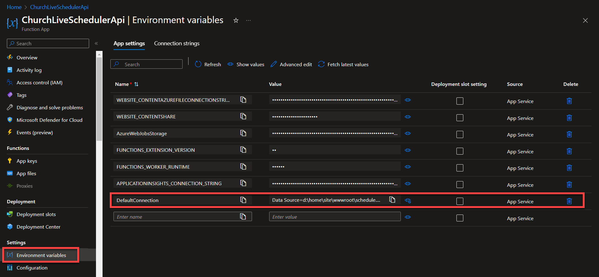
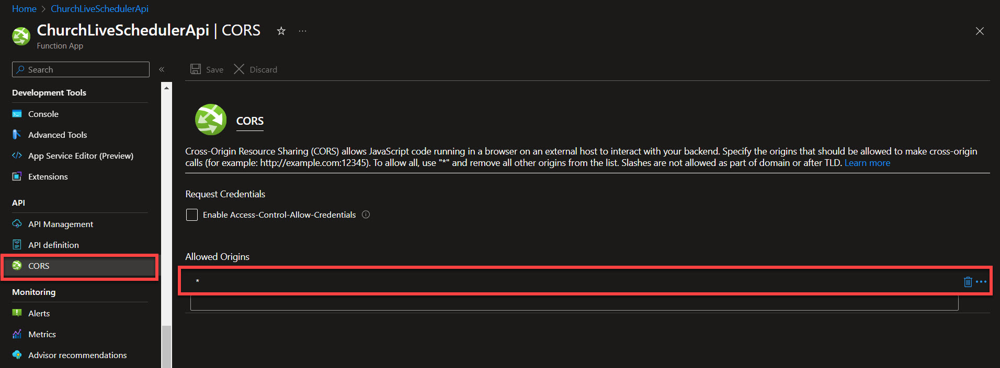

# ChurchLiveScheduler.api


ChurchLiveScheduler.api is a collection of API endpoints to retrieve and maintain a church's live stream schedule.  This project is implemented as Azure HTTP Trigger functions.

The system is capable of handling both weekly events (Sunday Morning Service) and special events (Christmas Eve Service).

## Database

[SQLite](https://www.sqlite.org/) is used here in an attempt to keep the cost of hosting to a
minimum.  The database is found in the file schedule.db

Use a VS Code extension such as [SQLite3 Editor](https://marketplace.visualstudio.com/items?itemName=yy0931.vscode-sqlite3-editor) to view and edit the database file.

The [Getting Started with EF Core](https://learn.microsoft.com/en-us/ef/core/get-started/overview/first-app?tabs=visual-studio) tutorial steps through creating an app that accesses SQLite.

### Connection String

The database connection string is configured differently if the system is running locally vs. in the cloud.

#### Localhost

On local, the connection string is set in the local.settings.json file

```json
{
    "IsEncrypted": false,
    "Values": {
        "DefaultConnection": "Data Source=schedule.db"
    }
}
```

#### Azure

On [Azure](https://portal.azure.com/), navigate to your Azure Function > Settings > Environment variables

| Name | Value |
| ---- | ----- |
| DefaultConnection | Data Source=d:\home\site\wwwroot\schedule.db |



### CORS

To be able to utilize this API directly from [ObsChurchLowerThirds](https://github.com/awjacobson/ObsChurchLowerThirds) or other browser app using XHR calls, etc., you will need to enable CORS.
On Azure, navigate to API > CORS > Allowed Origins: *



### Example usage (JavaScript)

```javascript
function requestNextService(onsuccess, onerror) {
    const xhr = new XMLHttpRequest();
    xhr.onload = () => {
        const data = JSON.parse(xhr.responseText);
        onsuccess(data.name, new Date(data.start));};
    xhr.onerror = () => {
        onerror(xhr.statusText);
    };
    xhr.open("GET", "https://churchliveschedulerapi.azurewebsites.net/api/GetNext", true);
    xhr.send();
}

requestNextService(initCountdown, console.error);

function initCountdown(title, date) {
    ...
}
```