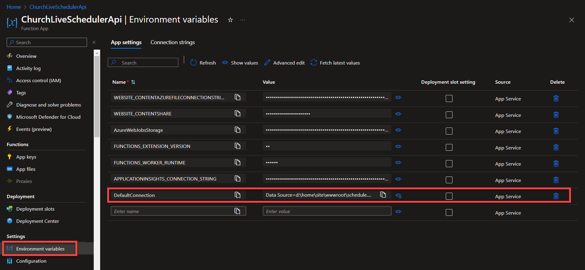
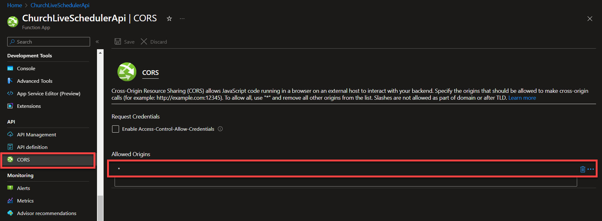

# ChurchLiveScheduler.api


ChurchLiveScheduler.api is a collection of API endpoints to retrieve and maintain a church's live stream schedule.  This project is implemented as Azure HTTP Trigger functions.

The system is capable of handling both weekly events (Sunday Morning Service) and special events (Christmas Eve Service).

## Database

[SQLite](https://www.sqlite.org/) is used here in an attempt to keep the cost of hosting to a
minimum.  The database is found in the file schedule.db

Use a VS Code extension such as [SQLite3 Editor](https://marketplace.visualstudio.com/items?itemName=yy0931.vscode-sqlite3-editor) to view and edit the database file.

The [Getting Started with EF Core](https://learn.microsoft.com/en-us/ef/core/get-started/overview/first-app?tabs=visual-studio) tutorial steps through creating an app that accesses SQLite.

### Connection String

The database connection string is configured differently if the system is running locally vs. in the cloud.

#### Localhost

On local, the connection string is set in the local.settings.json file

```json
{
    "IsEncrypted": false,
    "Values": {
        "DefaultConnection": "Data Source=schedule.db"
    }
}
```

#### Azure

On [Azure](https://portal.azure.com/), navigate to your Azure Function > Settings > Environment variables

| Name | Value |
| ---- | ----- |
| DefaultConnection | Data Source=d:\home\site\wwwroot\schedule.db |



### CORS

To be able to utilize this API directly from [ObsChurchLowerThirds](https://github.com/awjacobson/ObsChurchLowerThirds) or other browser app using XHR calls, etc., you will need to enable CORS.
On Azure, navigate to API > CORS > Allowed Origins: *



### Example usage (JavaScript)

```javascript
function requestNextService(onsuccess, onerror) {
    const xhr = new XMLHttpRequest();
    xhr.onload = () => {
        const data = JSON.parse(xhr.responseText);
        onsuccess(data.name, new Date(data.start));};
    xhr.onerror = () => {
        onerror(xhr.statusText);
    };
    xhr.open("GET", "https://churchliveschedulerapi.azurewebsites.net/api/GetNext", true);
    xhr.send();
}

requestNextService(initCountdown, console.error);

function initCountdown(title, date) {
    ...
}
```

### Further reading

* [Migrate .NET apps from the in-process model to the isolated worker model](https://learn.microsoft.com/en-us/azure/azure-functions/migrate-dotnet-to-isolated-model?tabs=net8)
* [Use dependency injection in .NET Azure Functions](https://learn.microsoft.com/en-us/azure/azure-functions/functions-dotnet-dependency-injection)
* [Azure Functions SQLite 'database is locked' error? - Here's the fix!](https://youtu.be/xSAyEDFLFTw?si=z3Ypt-cPfBA-Lsqr)

### Version History

### 1.0.2 - 2026-04-15
- Upgraded from .NET 8.0 to 10.0
- Updated NuGet packages to the latest version.
- [.editorconfig](https://learn.microsoft.com/en-us/visualstudio/ide/create-portable-custom-editor-options) file changed so services (*Service.cs) do not suggest fixing [IDE0290](https://learn.microsoft.com/en-us/dotnet/fundamentals/code-analysis/style-rules/ide0290). See also [Configuration files for code analysis rules](https://learn.microsoft.com/en-us/dotnet/fundamentals/code-analysis/configuration-files).
- Added `x-functions-key` to HTTP file for endpoints requiring authorization.

#### 1.0.1 - 2026-04-14
- Updated AWJ.ChurchLiveSchedulerSdk to v1.0.8
- DTOs now have the required modifier on many of their properties.
- Fixed async bug in ChurchLiveSchedulerFunction.UpdateSpecial method.
- Added SpecialEntityTypeConfiguration to account for the DateTime type change from string.
- Added HTTP file.
- Added .editorconfig file.